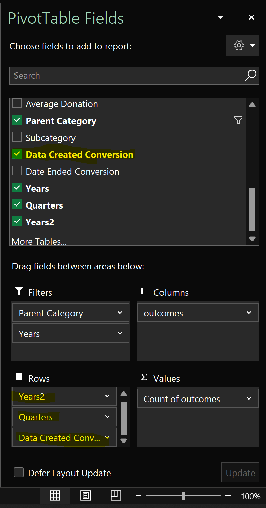
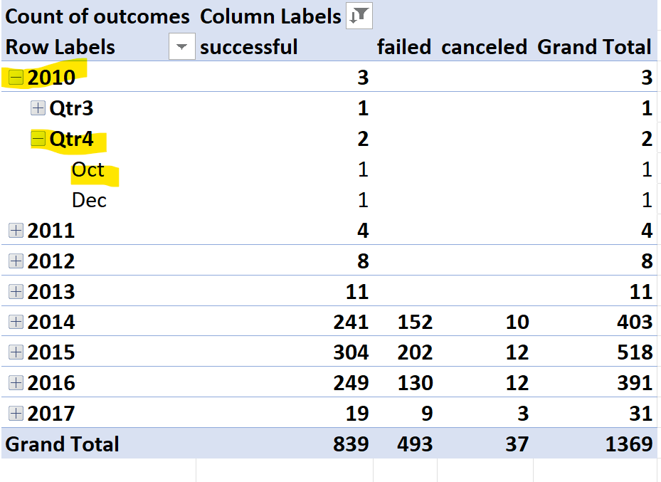

# An Analysis of Kickstarter Campaigns
Performing analysis on kickstarter data to uncover trends
## Overview of Project
This project focuses on a playwright's efforts to understand current crowdfunding successes and failures. The following report analyses the current crowdfunding data for best paths forward for Louise and her efforts to start a crowdfunding campaign. The project consists of two technical analyses: one focusing on the relationship between outcomes and launch months, and the other showing the relationship between goal-amount ranges and the fare of the projects. The report also includes a line chart to provide a visualization of the patterns. 
### Purpose
The purpose of this data analysis is to know how different campaigns succeeded or failed in relation to launch dates and funding goals for the purpose of preparing Louise to choose the appropriate time and goal range that will lead to a successful crowdfunding campaign.
## Analysis and Challenges
I began the analysis by isolating the years in which each campaign took place. In a new pivot table, I counted the number of successful, failed, and canceled campaigns of all categories based on the months in which they took place. This process may be confusing to some during the pivot table creation since when sorting by year, the table completes with fuller dates and more data that befuddles the results. 



This was easily remedied by filtering out unnecessary informaton and focusing on the months of the year in order to allow for clearer analyses.


 
A line chart was created from this pivot table to provide more clarity via visualization of the pattern of successful, failed, and canceled theater campaigns throughout the year.

A count of the fares of campaigns is helpful, however percentages are easier to grasp in terms of proportions. The second step taken was to use the COUNTIFS function to collect the number of successful, failed, and canceled campaigns for each goal range and compare the percentages for each fare. 

I did struggle in correctly inputting the COUNTIFS function. While I did take extra care to ensure that my inequality symbols were accurate to the goal boundaries, it was a challenge to produce accurate results when expanding and adjusting the function to other cells. My mistake was to not lock the cell range in the function to ensure that the data range remained.

The following is the original function. This worked successfully for the first cell.
```
=COUNTIFS(Kickstarter!F:F,"successful",Kickstarter!D:D,"<1000",Kickstarter!R:R,"plays")
```
When this was extended to the next cell, the data range shifted also:
```
=COUNTIFS(Kickstarter!G:G,"successful",Kickstarter!E:E,"<1000",Kickstarter!S:S,"plays")
```
Once that was corrected by securing the date range with the f4 key, I was able to extend the function and modify it for its intended data set without error. With that challenge resolved, I then completed the analysis by creating a line graph displaying the percentages of success for each goal range.
## Results
### Analysis of Outcomes Based on Launch Date
Two conclusions can be drawn from the analysis of Theater Outcomes Based on Launch Date: 
1. The most successful time to launch a campaign are during the summer months of May, June, and July. This is where we see the greatest rates of success in previous and current campaigns.
2. We also notice a spike in failed campaigns in October where there is also a gap in Canceled data. From this, we can gather that between September and November, there is more of a chance of a campaign failing. It may also be inferred that it would be better to cancel the campaign for a lesser chance of failure.
### Analysis of Outcomes Based on Goals
From the second analysis, it can be concluded that Louise can ask for up to $49,000 in order to have a better chance of a successful campaign. If Louise would like to fund more than that, she should set a goal amount between $35,000 to $44,999 where she would have a better chance of success than if she were to aim lower, such as between $25,000 to $29,000. It would be wise to take caution to not set a goal higher than $44,999 as that range has shown the highest percentage of failures.
### Challenges and Difficulties Encountered
We have evaluated the successes and failures of crowdfunding campaigns in terms of launch date and goal range. While this data has proved most beneficial in gaining insight on the best strategy for crowdfunding, there are limitaitons to this data. It would be beneficial to gather data on who the benefactors are such as their age, employment, number of times they have pledged, when and how often they pledge, and what kinds of kickstarters they choose to pledge to. By knowing who the audience is, Louise can have a better idea of where and whom to invite to donate. 

With the data we do have, we could have created different tables and graphs focusing on different area. For example, we could have studied the correlation between the country and the Category/Subcategory of the kickstarters to gain insight on which campaigns are most successful per country. Additionally, we could analyse the duration of the campaigns to see if the length of the campaign has any correlation with its success rate during any specific season of the year. Line plots focusing on seasons of the year and percentage of success and failure rates would be most useful. 

Lastly, it would be useful to include methods of crowdfunding in the dataset and then compare that data to benefactor ages and similar data. FOr example, if a benefactor is between the ages of 30 to 45 and chooses Facebook as their most active social media, it would be wise to use social media as a method of promoting the campaign. We can use the data produced from methods of crowdfunding and user information to gain better insight on the fare of kickstarters.
### Final Conclusion
In conclusion,the best time path forward  for Louise to ensure a higher rate of a successful campaign would be to launch the crowdfunding campaign in May with a goal of up to $1,000. 